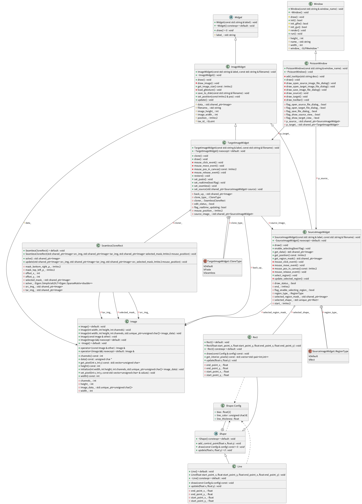

# 计算机图形学第三次作业实验报告

- ID：999（旁听）
- 姓名：袁保杰
- 学号：PB21111714

## 实验描述

本次实验要求：

- 必做部分：
  - 实现 Poisson Image Editing 算法（矩形边界）
  - 通过矩阵预分解等方法，提高图像编辑效率，实现实时拖动区域显示结果
- 选做部分：
  - 梯度融合（Mixing gradients）部分
  - 复杂边界实现（多边形光栅化的扫描线转换算法）

~~由于上周和本周以及未来的几周都被突发状况淹没~~，我仅完成了必做部分和梯度融合算法，未完成复杂边界编辑的实现。

## 算法简介

### 问题建模

> 这里都是我瞎扯的自己的理解，我不是学数学的而且数学很烂，若里面有理解不对的地方请指出 Orz（

将数字图像视为从二维坐标到 RGB 值的 $\R^2 \to \R^3$ 的映射，那么需要求解的是这样的问题：

- 输入：源图像 $g$，目标图像 $f^*$，目标图像中的待修改区域 $\Omega$
- 输出：新图像 $f$，满足
    - $f |_{\partial~\Omega} = f^* |_{\partial~\Omega}$，即边界条件
    - $f$ 在 $\Omega$ 内部的值通过插值得到

最简单的插值方法被称为 membrane interpolant，考虑下面的优化问题：

$$
\min_f \iint_\Omega |\nabla f|^2~\text{with}~f|_{\partial\Omega} = f^*|_{\partial\Omega}
$$

这是一个变分问题，可以转化为下面的拉普拉斯方程求解：

$$
\Delta f = 0~\text{over}~\Omega ~\dots
$$

但这种方法效果差，为了提高效果，在上面的优化问题中加入约束，即向量 $\bold v$ 作为 guidance：

$$
\min_f \iint_\Omega |\nabla f - \bold v|^2~\text{with}~f|_{\partial\Omega} = f^*|_{\partial\Omega}
$$

这里引导向量取 $\nabla g$，上式转化为下面的泊松方程：

$$
\Delta f = \text{div}~\bold v~\dots
$$

取 $\bold v = \nabla g$ 时，表示以源图像的梯度作为引导向量；但有时，当目标图像具有纹理，而源图像的纹理很弱时，我们可能想要保留目标图像的纹理，此时可以考虑融合源图像和目标图像的梯度。论文中提出的融合梯度公式下面：

$$
\forall x \in \Omega, \bold v(\bold x) = \left\{
\begin{array}{rcl}
\nabla f^*(\bold x) & \text{if}~|\nabla f^*(\bold x) > |\nabla g(\bold x)|\\
\nabla g(\bold x)   & \text{othereise}\\
\end{array} \right.
$$

### 泊松方程的数值解

由于任意边界的复杂性，直接将上面的变分问题用有限差分法离散化：

$$
\min_{f|_\Omega} \sum_{<p,q> \cap \Omega \ne \empty} (f_p - f_q - v_{pq})^2,~\text{with}~f_p = f_p^*, \text{for all}~p \in \partial \Omega
$$

其中：

- $p$ 为图像上任意一点
- $q$ 是 $p$ 的上下左右四个邻点
- $v_{pq}$ 是 $\bold v((p + q) / 2)$ 在 $[p, q]$ 边上的投影，即 $v_{pq} = \bold v((p + q) / 2) \cdot \vec pq$

它的解满足下面的线性方程组：

$$
\forall p \in \Omega, |N_p|f_p - \sum_{q \in N_p \cap \Omega}f_q = \sum_{q \in N_p \cap \partial \Omega} f_q^* + \sum_{q \in N_p} v_{pq}
$$

这是一个稀疏方程组。另外上式存在一些边界情形：

- 当 $\Omega$ 包含图像的边界时，有 $|N_p| < 4$
- 对于在 $\Omega$ 内部的 $p$，上式中的边界项不存在，退化为
    
    $$
    \forall p \in \Omega, |N_p|f_p - \sum_{p \in N_p \cap \Omega}f_q = \sum_{q \in N_p} v_{pq}
    $$

## 代码实现

本次实验程序对应的类图下面：



`SeamlessCloneRect` 类即为本次作业的代码实现，位于 `seamless_clone.cpp` 和 `seamless_clone.h` 文件中，基本考虑是尽可能少地改动框架代码。

类中的元素包括：

- `src_img_`, `tar_img_`：存储图像数据
- `selected_mask_`：描述源图像选中区域的 mask 矩阵
- `offset_x_`, `offset_y_`：目标图像编辑区域的左上角像素对应的坐标
- `mask_top_left_p_`, `mask_bottom_right_p_`：描述源图像选中的矩形
- `solver_`：Eigen 的稀疏线性方程组求解器

两个 public 接口分别为：

- `update`：传入源图像、目标图像和编辑区域 $\Omega$，更新对象内部的状态
  - 该接口主要用于完成实时编辑功能，当传入的源图像和编辑区域均不变时，上述稀疏方程组的系数矩阵保持不变，`solver_` 就不需要重复矩阵预分解的操作
- `solve`：填充方程组等式右侧的结果向量，用 `solver_` 求解稀疏方程组，返回编辑完成的目标图像

这两个接口实现之后，将 `SeamlessCloneRect` 对象加入 `seamless_cloner` 元素，然后在 `TargetImageWidget::clone` 中写 SeamlessClone 对应的分支即可：

```cpp
            cloner_.update(source_image_->get_data(), data_, mask,
                                mouse_position_);
            data_ = cloner_.solve();
```

## 实验结果

见 `src/assignments/3_PoissonImageEditing/result.mp4` 文件。

## 一些问题

- 在原图中选中超出边界的区域时程序会直接崩溃，~~感觉上不是我实现的锅，我也没修~~
- 编辑图像时，若超出目标图像的范围，下面会变黑一块，应该是超出范围导致边界条件出了问题，但是没时间修了